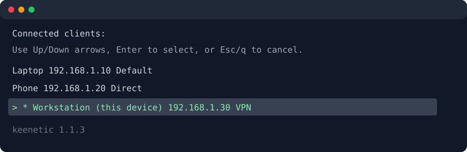

# Keenetic Policy CLI

A Bash CLI for listing Keenetic router clients and changing connection policies through the router's RCI API.



## Requirements

- Bash 4.3 or newer
- `curl`
- `jq`
- `md5sum` and `sha256sum`, or the macOS `md5` and `shasum` equivalents
- Optional: `fzf` for searchable interactive selection
- Python 3 and OpenSSL for the regression suite

## Install

From a checkout:

```bash
git clone https://github.com/osteotek/omarchy-keenetic.git
cd omarchy-keenetic
make install
keenetic-policy --init
```

The default installation path is `~/.local/bin/keenetic-policy`. Ensure it is in `PATH`. `make uninstall` removes the executable and Bash completion.

Tagged releases publish a standalone `keenetic-policy` executable, `SHA256SUMS`, and a source archive. Packaging definitions live under `packaging/` for Arch/AUR, Homebrew, and Debian.

## Configuration

Create and test the default configuration interactively:

```bash
keenetic-policy --init
```

The default path is `~/.config/keenetic-policy/config`. Override it with `KEENETIC_CONFIG`.

```ini
ROUTER_URL=https://router.example.keenetic.pro
ROUTER_USERNAME=admin
ROUTER_PASSWORD=replace-with-router-password
ROUTER_INSECURE=false
```

The generated file has mode `0600`. Values are literal; shell syntax is not evaluated.

### Password sources

Set exactly one of these:

```ini
ROUTER_PASSWORD=replace-with-router-password
ROUTER_PASSWORD_FILE=/home/user/.config/keenetic-policy/password
ROUTER_PASSWORD_COMMAND=secret-tool lookup service keenetic-policy
```

A password file must contain exactly one non-empty line. A password command is parsed as a space-separated executable and arguments. Pipelines, expansion, and shell quoting are intentionally unsupported. Other useful commands include `pass show routers/keenetic` and `keepassxc-cli show -q -a Password ~/Passwords.kdbx Keenetic`.

### Named routers

Store named profiles as separate configuration files:

```text
~/.config/keenetic-policy/routers/home
~/.config/keenetic-policy/routers/office
```

Select one with:

```bash
keenetic-policy --router home --json
keenetic-policy --router office --init
```

`--router` cannot be combined with `KEENETIC_CONFIG`.

To probe only the active default gateway for a compatible `/auth` endpoint, without scanning the subnet:

```bash
keenetic-policy --discover
```

### HTTPS trust

Trust a private router CA in the configuration:

```ini
ROUTER_CA_FILE=/home/user/.local/share/keenetic/router-ca.pem
```

Or for one invocation:

```bash
keenetic-policy --ca-file router-ca.pem --json
```

`--insecure` and `ROUTER_INSECURE=true` disable certificate verification and print a warning. Prefer a trusted CA or valid KeenDNS certificate. Plain HTTP also warns because it does not protect the authenticated session or API traffic.

## Listing clients

List connected clients:

```bash
keenetic-policy
```

```text
NAME                                 IP              POLICY
------------------------------------ --------------- ------------------
Laptop                               192.168.1.10    Default
* Workstation (this device)          192.168.1.20    VPN
```

Include known offline clients, or show only offline clients:

```bash
keenetic-policy --all
keenetic-policy --offline
```

Offline rows are marked explicitly and are never the default interactive selection.

Machine-readable output includes the stable MAC needed by mutation and Wake-on-LAN workflows:

```bash
keenetic-policy --all --json
```

```json
[
  {
    "name": "Living Room TV",
    "ip": "192.168.1.20",
    "mac": "aa:bb:cc:dd:ee:ff",
    "online": true,
    "blocked": false,
    "policy": "VPN",
    "policy_id": "Policy1"
  }
]
```

## Interactive use

```bash
keenetic-policy --interactive
keenetic-policy "Living Room TV"
```

When `fzf` is available, both client and policy menus are searchable, and client fields use aligned name, IP, policy, and status columns. Otherwise the built-in menu uses Up/Down arrows, Enter, and Esc or `q`. The native menu redraws after terminal resizing and conservatively truncates double-width Unicode. The current device and current policy are initially selected. Interactive policy choices include **Block Internet**, which requires confirmation.

## Mutations

Selectors match exact name, IP address, or MAC address:

```bash
keenetic-policy --client "Living Room TV" --policy VPN
keenetic-policy --ip 192.168.1.20 --policy Policy1
keenetic-policy --mac aa:bb:cc:dd:ee:ff --policy Default
```

Policy descriptions and IDs are matched case-insensitively. The CLI retries read-back verification at 0, 250, 500, and 1000 milliseconds before reporting verification failure.

Block or unblock Internet access:

```bash
keenetic-policy --client Tablet --block
keenetic-policy --client Tablet --unblock
```

Send Wake-on-LAN to a known client, including an offline client:

```bash
keenetic-policy --client Desktop --wake
```

The router's Wake-on-LAN response is included in the success message.

### Batch changes and dry runs

Repeat selectors to preflight every target before the first mutation:

```bash
keenetic-policy \
  --client Laptop \
  --ip 192.168.1.25 \
  --mac aa:bb:cc:dd:ee:ff \
  --policy VPN
```

Targets are deduplicated by MAC address. A batch is sequential, not atomic. If one mutation fails, the error identifies its position and how many earlier clients completed.

Preview resolution and the complete plan without sending a POST:

```bash
keenetic-policy --client Laptop --client Phone --policy VPN --dry-run
keenetic-policy --client Desktop --wake --dry-run
```

### Undo

Verified policy, block, and unblock changes are recorded in a bounded 20-entry history at `${XDG_STATE_HOME:-~/.local/state}/keenetic-policy/history.json`. Entries contain the router URL, client name and MAC, before/after state, action, and timestamp; no passwords, challenge hashes, or session cookies are stored.

Restore and verify the newest entry for the selected router:

```bash
keenetic-policy --undo
keenetic-policy --undo --dry-run
```

A successful undo consumes that history entry.

## Automation and diagnostics

Suppress successful mutation output:

```bash
keenetic-policy --quiet --client Laptop --policy Direct
```

Print sanitized connection, endpoint, client-count, policy-count, authentication-path, and verification diagnostics to stderr:

```bash
keenetic-policy --verbose --json
```

Verbose output never includes the configured password, challenge digest, response hash, or session cookie.

## Exit codes

| Code | Meaning |
|---:|---|
| 0 | Success, cancellation, or requested state already active |
| 1 | Configuration, authentication, connection, API, or action failure |
| 2 | Invalid command-line arguments |
| 3 | Client not found or ambiguous |
| 4 | Policy not found or ambiguous |
| 5 | Router accepted a mutation but the bounded read-back verification failed |

## Development

Run syntax checks, ShellCheck when installed, and the HTTP/HTTPS mock-router regression suite:

```bash
make check
```

Run the opt-in, read-only contract check against a real router:

```bash
KEENETIC_CONFIG=~/.config/keenetic-policy/config make check-router
```

The contract check only calls listing endpoints and validates the public JSON schema. It never sends a client mutation.

Build deterministic release artifacts:

```bash
make release
```

Tags matching `v*` run the full suite, verify that the tag matches the script version, and publish the generated artifacts through GitHub Actions.

## API reference

Authentication and client-policy endpoints follow the implementation in [Toxblh/Keenetic-Manager](https://github.com/Toxblh/Keenetic-Manager/blob/master/src/api/keenetic_router.py).

## License

MIT. See [LICENSE](LICENSE).
